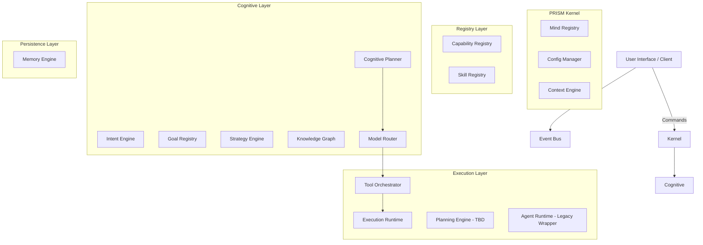
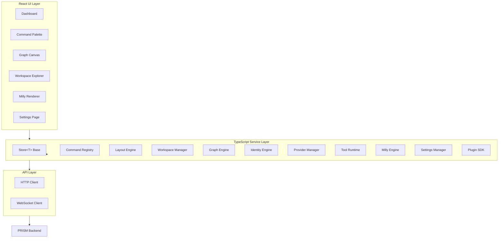

# PRISM Architecture

## Overview
PRISM is a highly modular, decoupled AI engineering platform. It is designed to act as a unified intelligence (One Mind) that can manifest in infinite shapes (interfaces). The architecture revolves around a central Kernel and a subsystem registration pattern, ensuring that PRISM owns the intelligence, not the interface.

## Cognitive Pipeline
The core reasoning loop in PRISM operates without executing any external work or provider API calls until the execution phase. The pipeline flows linearly:

1. **Intent Engine**: Classifies raw user requests, extracts capabilities and skills, and identifies the core objective.
2. **Goal Registry**: Maps the Intent into structured execution blueprints (Phases, Checkpoints, Deliverables).
3. **Strategy Engine**: Determines the execution policy (parallelization, reflection cadence, validation frequency) based on the goal.
4. **Knowledge Graph**: Traverses the semantic ontology to gather domain-specific context (e.g., framework docs, database schemas).
5. **Context Engine**: Injects the live runtime state (workspace, git metadata, active capabilities, resource usage).
6. **Cognitive Planner**: Consumes all previous outputs to generate a structured `ExecutionPlan` consisting of `ExecutionStage`s and `ExecutionTask`s.
7. **Model Router**: Evaluates each `ExecutionTask` against provider profiles, capabilities, complexity, and policy to produce a `RoutingDecision` for optimal model assignment.
8. **Tool Orchestrator**: Inspects each `ExecutionTask` (with its `RoutingDecision`) and produces a `ToolExecutionPlan` that specifies required, optional, and validation tools — along with execution order and a dependency graph. **No tools are executed at this stage.**

## Execution Pipeline

```
Planner (ExecutionPlan)
    ↓
    ├─ for each ExecutionTask
    │       ↓
    │   Model Router  →  RoutingDecision
    │       ↓
    │   Tool Orchestrator  →  ToolExecutionPlan
    │       ├── required_tools   (critical path, sequential)
    │       ├── optional_tools   (quality enhancers, parallel-eligible)
    │       ├── validation_tools (post-execution checks)
    │       ├── execution_order  (ordered groups of requirement IDs)
    │       ├── dependency_graph (forward adjacency list)
    │       ├── estimated_runtime_seconds        (sequential)
    │       └── estimated_parallel_runtime_seconds (max parallelism)
    ↓
Execution Runtime (consumes ToolExecutionPlan)
    ↓
    ├─ creates ExecutionSession
    ├─ manages Lifecycle (Pending → Queued → Running → Succeeded/Failed/Cancelled)
    ├─ handles RetryPolicy & Pause/Resume
    ├─ emits ExecutionEvents & progress tracking
    └─ dispatches ToolRequirements to BaseExecutors (MockExecutor for now)
```

## Tool Categories
The Tool Orchestrator supports 11 canonical tool categories:

| Category       | Example Tools                              |
|----------------|--------------------------------------------|
| `filesystem`   | `fs_read`, `fs_write`                      |
| `terminal`     | `terminal_exec`                            |
| `git`          | `git_read`, `git_write`                    |
| `docker`       | `docker_inspect`, `docker_exec`            |
| `python`       | `python_exec`, `python_lint`               |
| `browser`      | `browser_navigate`, `browser_interact`     |
| `http`         | `http_request`                             |
| `database`     | `db_query`, `db_write`                     |
| `vector_store` | `vector_search`, `vector_upsert`           |
| `mcp`          | `mcp_call`                                 |
| `local_script` | `local_script`                             |

## Tool Selection Logic
For every `ExecutionTask`, the Tool Orchestrator applies the following selection criteria (in priority order):
1. **Explicit hints** — `task.required_tools` entries matched against tool IDs / names.
2. **Capability matches** — task capabilities matched against tool `trigger_capabilities`.
3. **Skill matches** — task skills matched against tool `trigger_skills` (→ optional bucket).
4. **Keyword matches** — task name/description keywords matched against `trigger_keywords` (→ optional bucket).
5. **Checkpoint rules** — validation checkpoints always add `python_exec`, `python_lint`, `terminal_exec`; reflection checkpoints add `git_read`, `db_query`.

## Subsystem Diagram



## Desktop Client Layer

The PRISM Desktop application serves as the native shell visualizing and controlling the PRISM Core. Built with Tauri v2, React 19, TypeScript, Vite, and TailwindCSS, it communicates with the PRISM Backend through HTTP/REST API endpoints and WebSockets for real-time events.

The Desktop owns the user experience and visualization, while the PRISM Core retains all intelligence, ensuring that other frontends (e.g. web, mobile, CLI) can reuse the exact same backend interfaces.

### Desktop Architecture



### Manager Pattern

Every desktop service follows the Manager → Store → Hook pattern:

| Layer | Responsibility |
|-------|---------------|
| **Manager** | Stateless service class exposing public methods |
| **Store** | Extends `Store<State>`, owns reactive state, notifies subscribers |
| **Hook** | `useSyncExternalStore` binding consumed by React components |

## Implemented Modules
- **Kernel**: The central runtime and bootstrapper.
- **Mind Registry**: The subsystem locator and lifecycle manager.
- **Capability Registry**: Discovers and manages platform capabilities.
- **Skill Registry**: Discovers and loads engineering skills.
- **Intent Engine**: Translates requests to objectives.
- **Goal Registry**: Defines execution blueprints.
- **Strategy Engine**: Defines execution philosophies.
- **Knowledge Graph**: Semantic ontology for domain knowledge.
- **Context Engine**: Live runtime state management (workspace, git, hardware).
- **Cognitive Planner**: Converts goals/strategies into structured execution plans.
- **Model Router**: Selects optimal models/providers for tasks based on complexity and policy.
- **Tool Orchestrator**: Determines required tools per `ExecutionTask` and produces `ToolExecutionPlan`s. Provider-independent; does not execute tools.
- **Execution Runtime**: Manages ExecutionSession lifecycle (states, retry, pause/resume, events, metrics). Simulates tool execution using the MockExecutor pattern.
- **Desktop Service Layer**: 11 TypeScript managers following the Manager → Store → Hook pattern.
- **Desktop UI**: 7 React components implementing the frozen architecture specifications.
- **Plugin SDK**: Manifest-based lifecycle hooks for extensible capability registration.

## Planned Modules
- **Planning Engine**: Handles dynamic task decomposition and scheduling during execution.
- **Trust Engine**: Audits reflection processes and computes trust scores.
- **Resource Manager**: Monitors system resources dynamically.

## Version History
- **v0.1.0**: Initial implementation of the Kernel and Mind Registry.
- **v0.2.0**: Registry Layer (Capabilities, Skills) integrated.
- **v0.3.0**: Intent, Goal, and Strategy Engines implemented.
- **v0.4.0**: Knowledge Graph implemented with semantic traversal.
- **v0.5.0**: Cognitive Planner implemented (Intent -> ExecutionPlan).
- **v0.6.0**: Context Engine implemented (Live Runtime State).
- **v0.7.0**: Model Router implemented (Task -> RoutingDecision).
- **v0.8.0**: Tool Orchestrator implemented (Task + RoutingDecision -> ToolExecutionPlan). 11 tool categories, 18 built-in profiles, dependency graph, dual runtime estimates.
- **v0.9.0 Alpha**: Desktop client implemented. State Layer, Command Registry, Layout Engine, Workspace Manager, Graph Engine, Identity Engine, Provider Manager, Tool Runtime, Milly Engine, Settings Manager, Plugin SDK. Dashboard, Command Palette, Execution Graph Canvas, Workspace Explorer, Milly Renderer, Settings Page. Product hardening pass complete.
