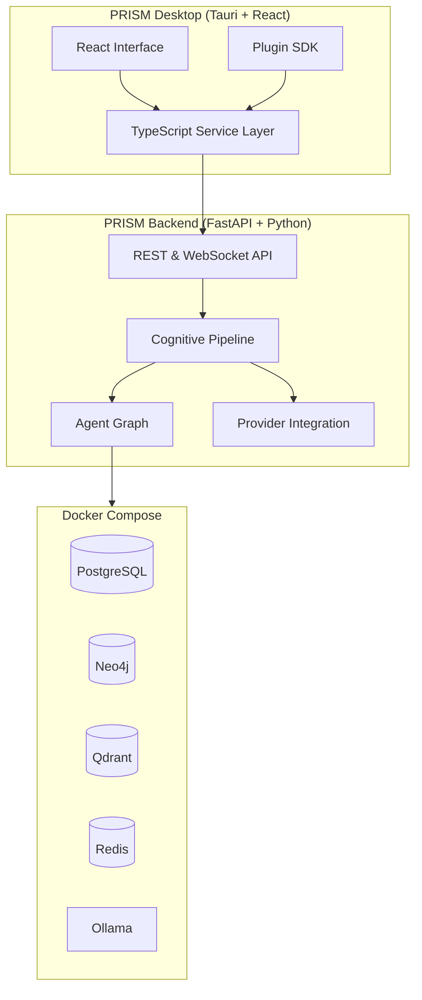
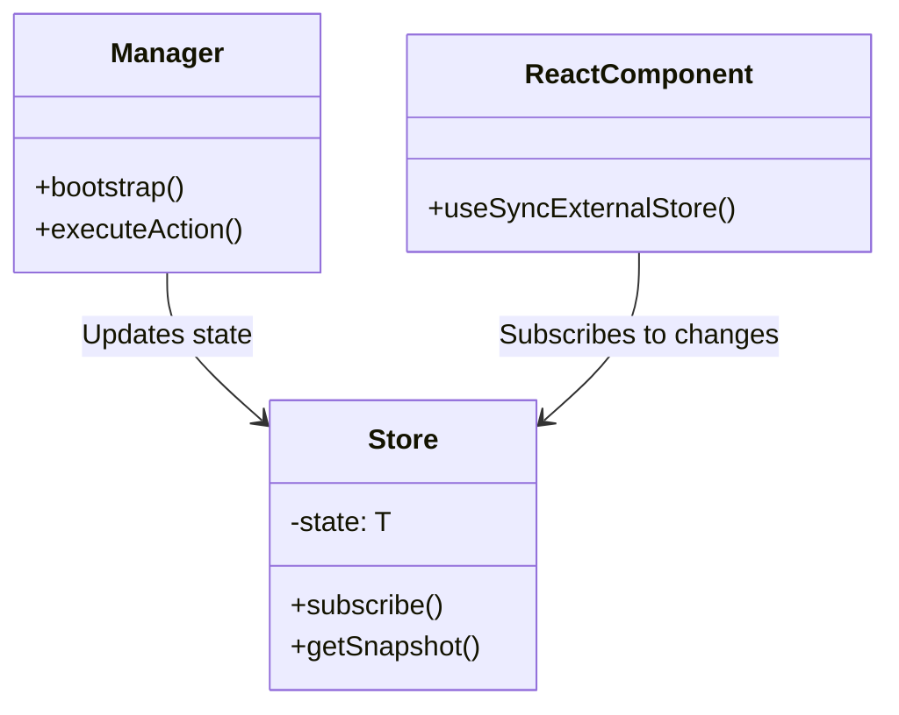
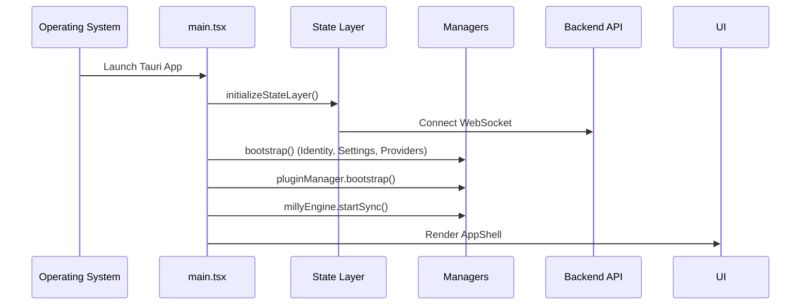

# PRISM Architecture (v0.9.0 Alpha)

PRISM is an **Agentic Intelligent Workspace** (see [11_PRODUCT_CONSTITUTION.md](11_PRODUCT_CONSTITUTION.md)): an open-source system that combines persistent memory, self-healing reasoning, multi-agent workflows, and visual cognition. PRISM owns intelligence; VS Code/Code-OSS may be embedded as an editing engine inside PRISM Desktop.

## High-Level Architecture

PRISM is divided into a backend cognitive pipeline and a frontend desktop client.

## Backend Cognitive Pipeline

The backend drives the intelligence of PRISM, orchestrating tasks through a series of specialized engines.

```mermaid
flowchart LR
    Intent[Intent Engine] --> Goals[Goal Registry]
    Goals --> Strategy[Strategy Engine]
    Strategy --> Knowledge[Knowledge Graph]
    Knowledge --> Context[Context Engine]
    Context --> Planner[Cognitive Planner]
    Planner --> Router[Model Router]
    Router --> Tools[Tool Orchestrator]
    Tools --> Runtime[Execution Runtime]
```

1. **Intent Engine**: Classifies raw requests and extracts capabilities.
2. **Goal Registry**: Maps intents to execution blueprints.
3. **Strategy Engine**: Determines execution policy (e.g., parallelization).
4. **Knowledge Graph**: Traverses semantic ontology for context.
5. **Context Engine**: Aggregates live runtime state.
6. **Cognitive Planner**: Generates structured `ExecutionPlan`.
7. **Model Router**: Evaluates tasks against provider profiles.
8. **Tool Orchestrator**: Produces `ToolExecutionPlan` per task.
9. **Execution Runtime**: Manages session lifecycle and state.

## Memory Engine

Memory is a core subsystem that operates alongside the cognitive pipeline.

- **Episodic**: Time-bound experiences.
- **Semantic**: Factual knowledge.
- **Procedural**: Acquired skills and tool usage.
- **Temporal**: State that expires over time.
- **Failure**: Records of what did not work (never decays).

## Desktop Service Layer

The desktop client uses a consistent `Manager` → `Store` → `Hook` pattern.

### Core Managers
- **WorkspaceManager**: Handles Projects, Sessions, and Artifacts.
- **LayoutManager**: Manages panels, docks, and UI state.
- **ToolManager**: Tracks tool lifecycles and logging.
- **ProviderManager**: Manages client-side provider connections.
- **MillyEngine**: Controls the cognitive presence state machine.

## Application Startup Sequence

## Plugin SDK

Plugins can extend the capabilities of the Desktop client. They interact with the system via lifecycle hooks.

1. `onRegister`: Register panels, commands, and providers.
2. `onStart`: Initialize background tasks.
3. `onStop`: Cleanup and unregister.
