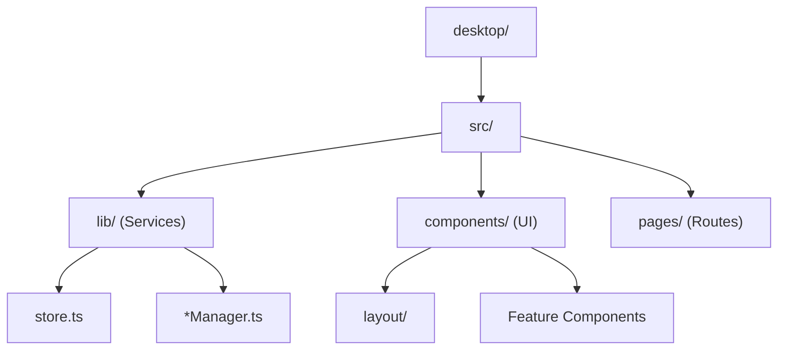
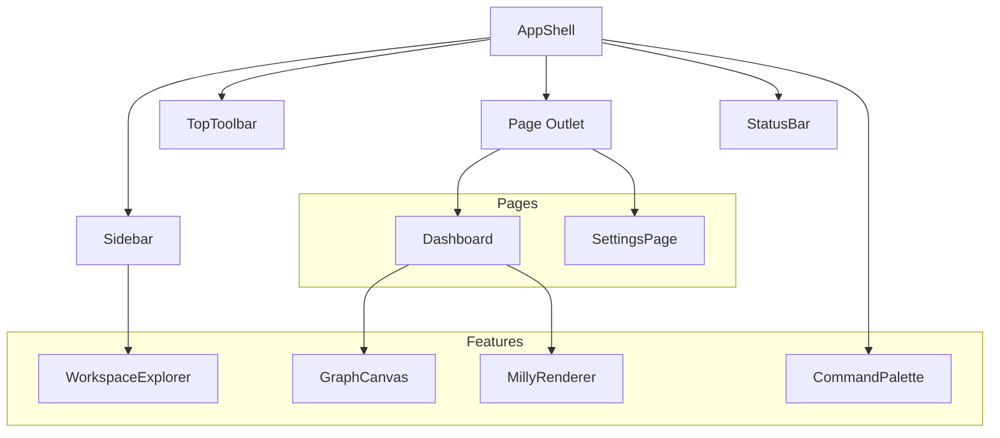

# PRISM Component Map

This document maps the React UI components and TypeScript services to their specific files within the PRISM Desktop client repository.

## Repository Structure Visualization

## TypeScript Service Layer (`desktop/src/lib/`)

These files contain the stateless managers and reactive stores that power the UI.

| Service | File | Purpose | Dependencies |
|---------|------|---------|--------------|
| **API Client** | `api.ts` | HTTP and WebSocket abstraction for communicating with the Python backend. | None |
| **State Layer** | `store.ts` | Generic `Store<T>` base class and `useSyncExternalStore` hooks. | `api.ts` |
| **Commands** | `commands.ts` | Command surface registration, fuzzy search, and keyboard shortcut parsing. | `store.ts` |
| **Default Cmds** | `defaultCommands.ts` | Bootstraps built-in system and navigation commands. | `commands.ts` |
| **Graph Engine** | `graph.ts` | Node/Edge models and topological layout for the execution graph. | `store.ts` |
| **Identity** | `identity.ts` | Local user profile, preferences, and capability tags. | `store.ts` |
| **Layout** | `layout.ts` | Panel registry, dock models, split layouts, and persistence. | `store.ts` |
| **Milly Engine** | `milly.ts` | Cognitive presence state machine mapped to runtime states. | `store.ts`, `api.ts` |
| **Plugins** | `plugins.ts` | Manifest lifecycle hooks (register/start/stop) and cleanup. | All Managers |
| **Providers** | `providers.ts` | Client-side provider configurations and health tracking. | `store.ts`, `api.ts` |
| **Settings** | `settings.ts` | Category-based settings, schema validation, import/export. | `store.ts` |
| **Tools** | `tools.ts` | Tool session tracking and structured logging. | `store.ts` |
| **Workspace** | `workspace.ts` | Project, Session, and Artifact CRUD with local persistence. | `store.ts` |

## React UI Composition (`desktop/src/components/`)

| Component | File | Purpose | State Dependencies |
|-----------|------|---------|--------------------|
| **App Shell** | `layout/AppShell.tsx` | The root layout wrapper containing structural blocks. | `LayoutManager` |
| **Sidebar** | `layout/Sidebar.tsx` | Vertical navigation and panel docking area. | `LayoutManager` |
| **Top Toolbar** | `layout/TopToolbar.tsx` | Header actions and breadcrumbs. | `IdentityManager` |
| **Status Bar** | `layout/StatusBar.tsx` | Footer system status. | `KernelStore`, `MillyEngine` |
| **Command Palette**| `CommandPalette.tsx` | `Ctrl+K` global command search overlay. | `CommandRegistry` |
| **Graph Canvas** | `GraphCanvas.tsx` | SVG interactive execution DAG. | `GraphEngine` |
| **Milly Renderer** | `MillyRenderer.tsx` | Animated SVG representation of the cognitive state. | `MillyEngine` |
| **Workspace** | `WorkspaceExplorer.tsx` | File/Project tree viewer. | `WorkspaceManager` |

## Pages (`desktop/src/pages/`)

| Route | Page | File | Purpose |
|-------|------|------|---------|
| `/` | **Dashboard** | `Dashboard.tsx` | The default view. Shows execution status, kernel health, and workspace summaries. |
| `/settings` | **Settings** | `Settings.tsx` | System and user configuration interface. |
| `/*` | **Placeholder** | `Placeholder.tsx` | Development placeholder for unimplemented routes. |
