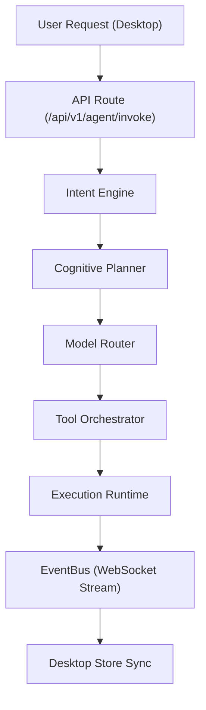

# PRISM Development Guide

This guide explains how to set up the PRISM development environment, run services locally, and debug the execution pipeline.

Product identity: see [11_PRODUCT_CONSTITUTION.md](11_PRODUCT_CONSTITUTION.md).  
Active client: `desktop/` (Tauri + React). Do not use the removed `frontend/` placeholder.

## System Prerequisites

| Tool | Version | Notes |
|------|---------|-------|
| Python | 3.12+ | Backend |
| Node.js | 22+ | Desktop Vite/Tauri UI |
| Rust | stable | Required for `npm run tauri` native shell |
| Docker | Desktop/Engine + Compose | Infra (Postgres, Neo4j, Qdrant, Redis, Ollama) |

## Recommended local layout

1. Start infra with Docker Compose (databases + Ollama).
2. Run the API with uvicorn on the host (`backend/`).
3. Run the desktop UI with Vite (`desktop/`), optionally Tauri for native FS.

---

## 1. Environment files

| File | Purpose |
|------|---------|
| `.env.example` → `.env` (repo root) | Docker Compose service hostnames |
| `backend/.env.example` → `backend/.env` | Local uvicorn talking to localhost ports |

```bash
# Docker / full compose
cp .env.example .env

# Local API (host) + Docker infra
cp backend/.env.example backend/.env
```

Never commit real API keys.

---

## 2. Backend Setup

```bash
cd backend

# Create virtual environment
python -m venv .venv

# Activate (Windows)
.venv\Scripts\activate

# Activate (Unix)
source .venv/bin/activate

# Install package + test tools
pip install -e ".[dev]"

# Note (Windows): `litellm` is pinned to `<1.73` in pyproject.toml so pip
# can use binary wheels. Newer litellm source builds may require Rust/Cargo on PATH.

# Local env (localhost hosts)
cp .env.example .env

# Run FastAPI — use the factory entrypoint (there is no module-level `app`)
uvicorn prism.main:create_app --factory --reload --host 127.0.0.1 --port 8000
```

API docs: http://127.0.0.1:8000/docs

```bash
# Tests
pytest tests/ -v
```

---

## 3. Desktop Setup

```bash
cd desktop
npm install

# Vite UI only (browser, http://127.0.0.1:1420) — mock FS in browser
npm run dev

# Native Tauri shell (real FS commands; needs Rust)
npm run tauri -- dev

# Production web build check
npm run build
```

The desktop client expects the API at `http://127.0.0.1:8000` and WebSocket at `ws://127.0.0.1:8000/api/v1/events/ws`.

---

## 4. Infrastructure (Docker Compose)

From the repository root:

```bash
cp .env.example .env

# Core stack (backend + worker + data plane + Ollama + observability)
docker compose up --build

# Infra only (when running uvicorn on the host)
docker compose up -d postgres neo4j qdrant redis ollama
```

The deprecated placeholder web service is **not** started by default. To run it:

```bash
docker compose --profile legacy-web up frontend
```

| Service | Host port | Purpose |
|---------|-----------|---------|
| Backend | 8000 | FastAPI + OpenAPI |
| PostgreSQL | 5432 | Relational storage |
| Neo4j | 7474 / 7687 | Graph |
| Qdrant | 6333 | Vectors |
| Redis | 6379 | Cache + Celery |
| Ollama | **11435** → 11434 | Local LLM (note host mapping) |
| Prometheus | 9090 | Metrics |
| Grafana | 3001 | Dashboards |

---

## Execution Pipeline Debugging



### Debugging tips

1. **WebSocket**: Browser DevTools → Network → WS. Kernel online state follows real socket connectivity.
2. **REST envelope**: Responses are `{ "data": ..., "meta": ... }`. The desktop client unwraps `data`.
3. **CORS**: Debug mode allows all origins; production allow-list includes Vite `:1420` and Tauri origins.
4. **Tool failures**: Desktop `ToolManager` tracks events; backend still uses `MockExecutor` by default.
5. **Database reset**: `docker compose down -v`
