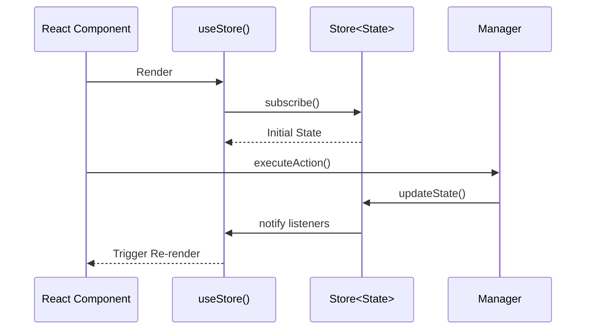
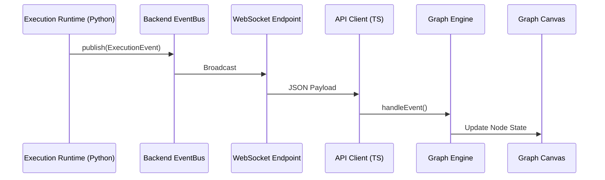
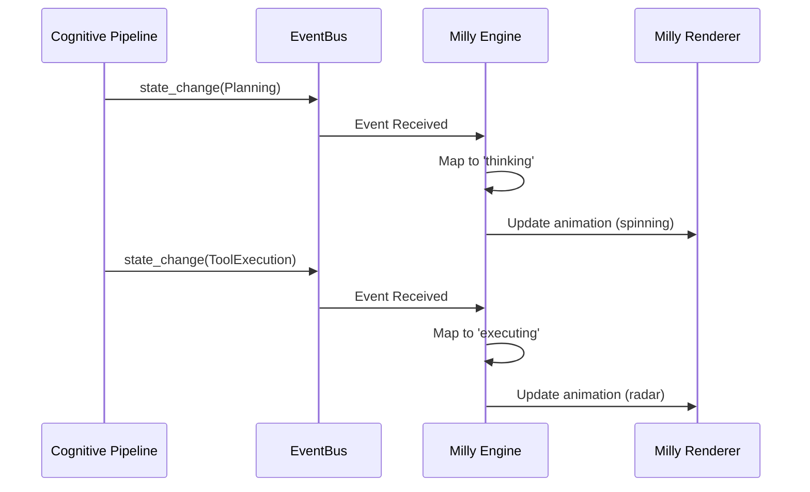

# PRISM Event Flow

This document outlines the data and event flow patterns that synchronize the PRISM Backend (Python) with the PRISM Desktop (TypeScript/React).

## Architecture

PRISM uses a unidirectional data flow locally, combined with WebSocket-based event streaming from the backend.

### 1. Store Subscription Flow (Local)

The Desktop Service Layer uses `useSyncExternalStore` to connect React components to vanilla TypeScript classes.

### 2. Live Execution Flow (Backend to Desktop)

During an execution session, the backend emits events via the `EventBus` which are streamed to the desktop via WebSockets.

### 3. Cognitive Presence Sync (Milly)

Milly's visual presence is a reflection of the backend's runtime state. It never acts independently.

## Event Types

### WebSocket Events (actual)

Canonical inventory: [API_SURFACE.md](API_SURFACE.md).

| Category | Event types emitted today | Publisher |
|----------|---------------------------|-----------|
| **Kernel** | `kernel_boot`, `kernel_shutdown` | `prism/kernel.py` |
| **Execution** | `runtime.<ExecutionEventType>` (see API_SURFACE) | `ExecutionRuntime` when a session runs |

### Not emitted (do not invent clients for these yet)

Older drafts mentioned `kernel.ready`, `memory.stored`, `execution.started`, `tool.started`. Those names are **not** published by the current EventBus. Use the table in `API_SURFACE.md` §3.2–3.3.

### Desktop Local Events

Locally, the desktop relies on the `Store<State>` observer pattern rather than a global event bus. Managers update their respective stores, which instantly trigger UI re-renders.
