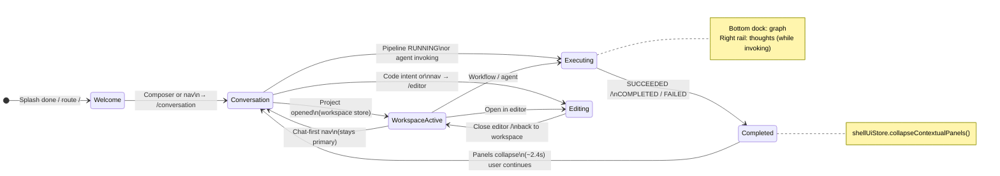

# PRISM Desktop — Sprint R4 Experience State Engine

Last updated: 2026-07-27

**Architecture impact:** ZERO — derived presentation layer only; routes, managers, stores, and workflows unchanged.

---

## 1. State transition diagram

**Priority (derivation):** `editing` → `executing` → `completed` (terminal pipeline) → `workspace-active` (project + conversation/workspace route) → `conversation` → `welcome`.

Implementation: `desktop/src/lib/experienceState.ts` → `deriveExperienceState()`.

---

## 2. Screens affected

| Route (unchanged) | Experience state(s) | Presentation change |
| --- | --- | --- |
| `/` | Welcome | Landing; entry to conversation |
| `/conversation` | Conversation, Workspace active, Executing, Completed | Primary stage; panels contextual |
| `/workspace` | Workspace active, Executing | Contextual project chrome |
| `/editor` | Editing | Editor only when task-driven |
| `/settings` | Conversation (fallback label) | Unchanged page |
| `/memory`, `/thoughts`, `/execution`, … | N/A (redirect) | Still open contextual panels only |

**Shell:** `AppShell`, `Sidebar`, `TopToolbar` reflect derived state; page components are not rewritten.

---

## 3. Animations proposed (existing tokens)

| Moment | Class / token | Use |
| --- | --- | --- |
| State change (main stage) | `prism-enter-fast` | `AppShell` outlet `key={experience.state}` |
| Experience label | `prism-enter-fast` | `ExperienceStageBadge` |
| Panel open | `prism-enter-right` / `prism-enter-bottom` | Already on `IntelligenceRail` / `ExecutionDock` |
| Panel close | `duration-ui` + opacity on dock/rail | Collapse after Completed (no new keyframes) |
| Conversation turns | `prism-enter-up` | Unchanged on `ConversationTurnCard` |

No new animation system — reuse `index.css` PRISM motion tokens.

---

## 4. Components removed

**None.** No routes or pages deleted. Permanent “dashboard” patterns were already removed in R1.

Optional future cleanup (not R4): duplicate panel toggles on `ChatHub` if toolbar becomes sole control — **not removed in this sprint**.

---

## 5. Components reused

| Layer | Components / modules |
| --- | --- |
| Shell | `AppShell`, `Sidebar`, `TopToolbar`, `StatusBar`, `IntelligenceRail`, `ExecutionDock` |
| Pages | `Dashboard` / `LandingHome`, `ConversationPage`, `WorkspacePage`, `EditorPage`, `SettingsPage`, `ContextualPanelRoute` |
| Stores | `workspaceStore`, `executionStore`, `agentStore`, `shellUiStore`, `notificationStore` |
| Managers | `WorkspaceManager`, workflows (`conversation`, `openWorkspace`, `codeModification`), `agentManager` |
| **New (presentation only)** | `experienceState.ts`, `useExperienceOrchestration.ts`, `ExperienceStageBadge` |

---

## 6. Architecture impact

| Area | Impact |
| --- | --- |
| Managers | None |
| Stores | None (read-only subscribe); `shellUiStore.collapseContextualPanels()` helper only |
| Backend | None |
| Routing | Same `react-router` table |
| Workflows | Unchanged; still call `shellUiStore.setRightTab` / `setBottomTab` |

---

## Operator notes

- **Conversation** remains the default journey: Welcome → `/conversation`.
- **Editor** route still exists; state shows **Editing** only on `/editor`.
- After a run finishes, contextual panels auto-collapse after ~2.4s if the pipeline transitioned from executing → terminal.
- Sidebar highlights **experience state**, not only URL (e.g. Executing highlights Conversation).

## Files added / touched (R4)

- `desktop/src/lib/experienceState.ts`
- `desktop/src/lib/useExperienceOrchestration.ts`
- `desktop/src/components/experience/ExperienceStageBadge.tsx`
- `desktop/src/components/layout/AppShell.tsx`
- `desktop/src/components/layout/Sidebar.tsx`
- `desktop/src/components/layout/TopToolbar.tsx`
- `desktop/src/lib/shellUi.ts` (`collapseContextualPanels`)
- `docs/EXPERIENCE_STATE_R4.md`
