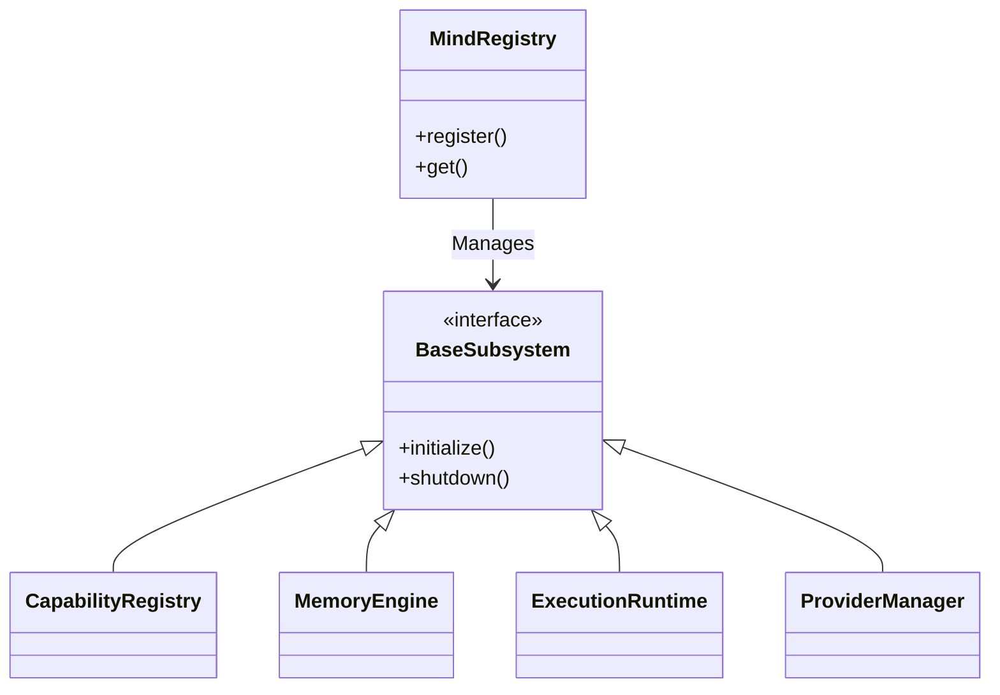
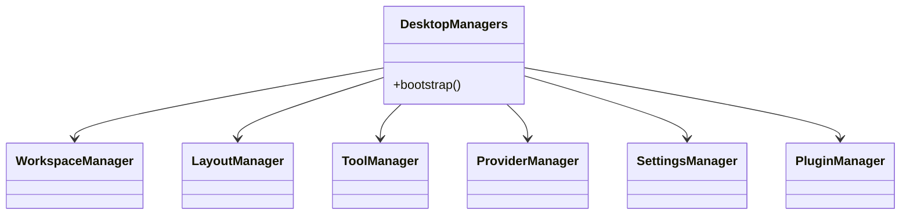
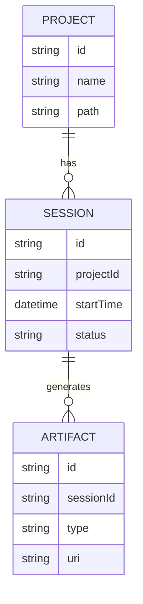
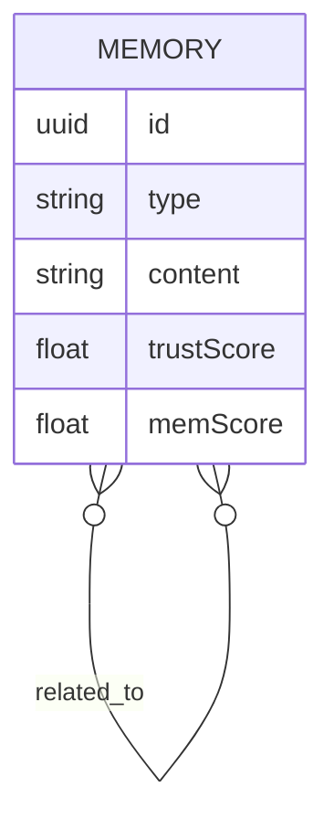

# PRISM Service Overview

This document catalogs every major backend subsystem and desktop manager in PRISM v0.9.0 Alpha.

## Backend Subsystems (Python)

All backend subsystems are initialized by the PRISM Kernel and registered in the `MindRegistry`.

| Subsystem | Responsibility |
|-----------|----------------|
| **ConfigManager** | Resolves configurations from defaults, environment, and user overrides. |
| **CapabilityRegistry** | Discovers and exposes the 20 built-in engineering capabilities. |
| **IntentEngine** | Parses raw user input to determine objectives and required capabilities. |
| **GoalRegistry** | Maps intents into structured execution blueprints. |
| **KnowledgeGraph** | Traverses semantic rules and domain context. |
| **ContextEngine** | Aggregates the live state of the OS, workspace, and git branch. |
| **CognitivePlanner** | Generates an `ExecutionPlan` from goals and context. |
| **ModelRouter** | Selects the optimal provider/model for each task based on complexity. |
| **ToolOrchestrator** | Selects the specific tools required for a task and prepares execution profiles. |
| **ExecutionRuntime** | Manages the lifecycle of an `ExecutionSession` and streams events. |
| **MemoryEngine** | Manages classification, scoring, storage, and retrieval of memory. |
| **ProviderManager** | Wraps LiteLLM to provide a unified interface to Ollama, OpenAI, etc. |

## Desktop Managers (TypeScript)

Desktop managers are stateless service classes that mutate reactive stores. They are exported as singletons from `desktop/src/lib/`.

| Manager | Responsibility |
|---------|----------------|
| **WorkspaceManager** | CRUD operations for Projects, Sessions, and Artifacts. Local persistence. |
| **LayoutManager** | Controls the dock model, panel registry, and split view state. |
| **CommandRegistry** | Centralized fuzzy search and keyboard shortcut resolution. |
| **IdentityManager** | User profile, preferences, and customized capability tags. |
| **ProviderManager** | Client-side definition of LLM providers and health checks. |
| **ToolManager** | Tracks active tool sessions and aggregates structured logs. |
| **SettingsManager** | Configuration schema validation, categorized UI models, and import/export. |
| **PluginManager** | Manifest-based SDK for extending the desktop capabilities. |
| **GraphEngine** | Coordinate computation for the SVG execution graph. |
| **MillyEngine** | Synchronizes WebSocket events to visual cognitive presence states. |

## Core Data Structures

### Workspace ER Model

### Memory ER Model

